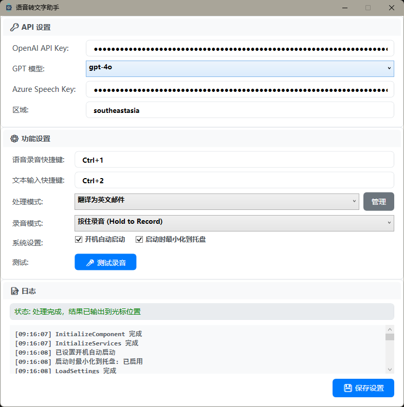
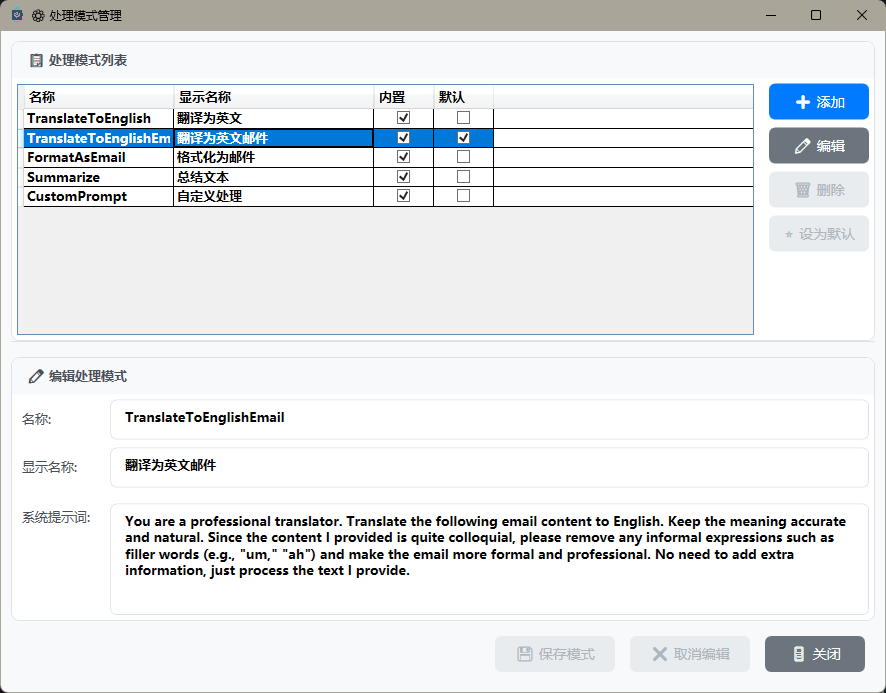

# 🎤 AuuVoice - AI-Powered Speech-to-Text Assistant

[English](#english) | [中文](#中文)

---

## 中文

### 📖 简介

**AuuVoice** 是一款强大的AI驱动语音转文字助手，作为 Aqua Voice 的开源替代方案。它集成了 Azure 语音识别服务和 OpenAI GPT 模型，为用户提供智能的语音转文字、文本处理和自动化输入解决方案。

### ✨ 核心特性

#### 🎯 智能语音识别
- **实时语音转文字**：基于 Azure 认知服务的高精度语音识别
- **多种录音模式**：支持按住录音和切换录音两种模式
- **全局快捷键**：可自定义快捷键，随时随地启动录音
- **可视化录音提示**：录音时显示动态覆盖层，直观反馈录音状态

#### 🤖 AI 文本处理
- **多种处理模式**：
  - 📧 **翻译为英文邮件**：将中文语音转换为专业英文邮件格式
  - 🌐 **翻译为英文**：准确自然的中英文翻译
  - 📝 **格式化为邮件**：将口语化内容整理为正式邮件格式
  - 📋 **文本总结**：智能提取文本要点和摘要
  - 🔧 **自定义处理**：支持用户自定义 AI 处理提示词

#### ⌨️ 智能文本输入
- **快捷文本输入**：通过快捷键快速调出文本输入框
- **AI 文本处理**：输入的文本可通过 AI 处理后自动发送到目标应用
- **精准窗口定位**：确保处理后的文本准确返回到原始应用程序

#### 🔧 系统集成
- **系统托盘运行**：最小化到系统托盘，不占用桌面空间
- **开机自启动**：支持 Windows 开机自动启动
- **全局快捷键**：系统级快捷键支持，无需切换窗口
- **多模型支持**：支持 GPT-3.5、GPT-4、GPT-4 Turbo 等多种模型

### 🖼️ 界面预览

<!-- 主界面截图 -->

*主界面 - 简洁直观的设置界面*

<!-- 录音界面截图 -->

*录音界面 - 实时录音状态显示*

<!-- 文本输入界面截图 -->

*文本输入界面 - 快速文本输入和处理*

<!-- 处理模式管理截图 -->

*处理模式管理 - 自定义 AI 处理规则*

### 🚀 快速开始

#### 系统要求
- Windows 10/11
- .NET 9.0 Runtime
- 网络连接（用于 API 调用）

#### 安装步骤

1. **下载发布版本**
   ```bash
   # 从 Releases 页面下载最新版本
   # 或克隆源代码自行编译
   git clone https://github.com/superauu/AuuVoice.git
   ```

2. **配置 API 密钥**
   - 获取 [Azure 语音服务](https://azure.microsoft.com/zh-cn/services/cognitive-services/speech-services/) API 密钥
   - 获取 [OpenAI](https://openai.com/) API 密钥
   - 在应用程序中填入相应的 API 密钥和区域

3. **设置快捷键**
   - 语音录音快捷键（默认：`Ctrl+Alt+M`）
   - 文本输入快捷键（默认：`Ctrl+Alt+T`）

4. **开始使用**
   - 按下语音录音快捷键开始录音
   - 说话完成后，AI 将自动处理并输入文本
   - 使用文本输入快捷键进行快速文本处理

### 📋 使用场景

#### 💼 商务办公
- **邮件撰写**：语音输入中文，自动转换为专业英文邮件
- **会议记录**：实时语音转文字，快速生成会议纪要
- **文档编辑**：语音输入内容，AI 自动格式化和优化

#### 🌐 跨语言交流
- **即时翻译**：中文语音实时转换为英文文本
- **邮件翻译**：将中文邮件内容快速转换为英文
- **文档本地化**：批量处理多语言文档内容

#### 📝 内容创作
- **文章写作**：语音输入想法，AI 整理为结构化文本
- **社交媒体**：快速生成各平台适配的内容格式
- **学习笔记**：语音记录学习内容，自动整理要点

### ⚙️ 配置说明

#### API 设置
- **OpenAI API Key**：用于文本处理和翻译
- **GPT 模型选择**：支持 gpt-3.5-turbo、gpt-4、gpt-4-turbo、gpt-4o
- **Azure Speech Key**：用于语音识别服务
- **Azure 区域**：选择最近的服务区域以获得最佳性能

#### 功能设置
- **快捷键自定义**：可自定义语音录音和文本输入快捷键
- **处理模式**：选择默认的 AI 文本处理模式
- **录音模式**：按住录音或切换录音模式
- **系统设置**：开机自启动、托盘最小化等选项

### 🔧 开发和编译

#### 开发环境
- Visual Studio 2022 或 Visual Studio Code
- .NET 9.0 SDK
- Windows SDK

#### 快速开始

**方法一：使用自动化脚本（推荐）**
```bash
# 克隆仓库
git clone https://github.com/superauu/AuuVoice.git
cd AuuVoice

# 运行安装脚本（自动安装依赖并构建）
.\install.ps1

# 快速启动应用
.\run.ps1
# 或使用批处理文件
.\run.bat
```

**方法二：手动编译**
```bash
# 还原依赖
dotnet restore

# 编译项目
dotnet build

# 发布应用
dotnet publish -c Release -o publish

# 运行应用
dotnet run
```

#### 项目结构
```
AuuVoice/
├── Models/                 # 数据模型
│   ├── AppSettings.cs     # 应用设置
│   └── ProcessingMode.cs  # 处理模式定义
├── Services/              # 服务层
│   ├── ChatGptService.cs  # OpenAI API 服务
│   ├── SpeechRecognizerService.cs # 语音识别服务
│   ├── HotkeyService.cs   # 快捷键服务
│   └── OutputSimulator.cs # 文本输出模拟
├── UI/                    # 用户界面
│   ├── MainWindow.xaml    # 主窗口
│   ├── TextInputWindow.xaml # 文本输入窗口
│   └── RecordingOverlayWpf.xaml # 录音覆盖层
└── ConfigManager.cs       # 配置管理
```

### 🤝 贡献指南

我们欢迎社区贡献！请遵循以下步骤：

1. Fork 本仓库
2. 创建特性分支 (`git checkout -b feature/AmazingFeature`)
3. 提交更改 (`git commit -m 'Add some AmazingFeature'`)
4. 推送到分支 (`git push origin feature/AmazingFeature`)
5. 开启 Pull Request

### 📄 许可证

本项目采用 MIT 许可证 - 查看 [LICENSE](LICENSE) 文件了解详情。

### 🙏 致谢

- [Azure 认知服务](https://azure.microsoft.com/zh-cn/services/cognitive-services/) - 语音识别服务
- [OpenAI](https://openai.com/) - GPT 模型支持
- [Hardcodet.NotifyIcon.Wpf](https://github.com/hardcodet/wpf-notifyicon) - 系统托盘支持

---

## English

### 📖 Introduction

**AuuVoice** is a powerful AI-driven speech-to-text assistant that serves as an open-source alternative to Aqua Voice. It integrates Azure Speech Services and OpenAI GPT models to provide intelligent speech-to-text conversion, text processing, and automated input solutions.

### ✨ Key Features

#### 🎯 Intelligent Speech Recognition
- **Real-time Speech-to-Text**: High-precision speech recognition powered by Azure Cognitive Services
- **Multiple Recording Modes**: Support for both hold-to-record and toggle-record modes
- **Global Hotkeys**: Customizable hotkeys for instant recording activation
- **Visual Recording Feedback**: Dynamic overlay display during recording for intuitive status feedback

#### 🤖 AI Text Processing
- **Multiple Processing Modes**:
  - 📧 **Translate to English Email**: Convert Chinese speech to professional English email format
  - 🌐 **Translate to English**: Accurate and natural Chinese-to-English translation
  - 📝 **Format as Email**: Organize colloquial content into formal email format
  - 📋 **Text Summarization**: Intelligent extraction of key points and summaries
  - 🔧 **Custom Processing**: Support for user-defined AI processing prompts

#### ⌨️ Smart Text Input
- **Quick Text Input**: Rapid text input box activation via hotkeys
- **AI Text Processing**: Input text can be processed by AI and automatically sent to target applications
- **Precise Window Targeting**: Ensures processed text returns accurately to the original application

#### 🔧 System Integration
- **System Tray Operation**: Minimize to system tray without occupying desktop space
- **Auto-start on Boot**: Support for Windows startup automation
- **Global Hotkeys**: System-level hotkey support without window switching
- **Multi-model Support**: Support for GPT-3.5, GPT-4, GPT-4 Turbo, and other models

### 🖼️ Interface Preview

<!-- Main interface screenshot -->

*Main Interface - Clean and intuitive settings interface*

<!-- Recording interface screenshot -->

*Recording Interface - Real-time recording status display*

<!-- Text input interface screenshot -->

*Text Input Interface - Quick text input and processing*

<!-- Processing mode management screenshot -->

*Processing Mode Management - Custom AI processing rules*

### 🚀 Quick Start

#### System Requirements
- Windows 10/11
- .NET 9.0 Runtime
- Internet connection (for API calls)

#### Installation Steps

1. **Download Release**
   ```bash
   # Download the latest version from the Releases page
   # Or clone the source code and compile yourself
   git clone https://github.com/superauu/AuuVoice.git
   ```

2. **Configure API Keys**
   - Obtain [Azure Speech Services](https://azure.microsoft.com/en-us/services/cognitive-services/speech-services/) API key
   - Obtain [OpenAI](https://openai.com/) API key
   - Enter the corresponding API keys and region in the application

3. **Set Hotkeys**
   - Speech recording hotkey (default: `Ctrl+Alt+M`)
   - Text input hotkey (default: `Ctrl+Alt+T`)

4. **Start Using**
   - Press the speech recording hotkey to start recording
   - After speaking, AI will automatically process and input text
   - Use the text input hotkey for quick text processing

### 📋 Use Cases

#### 💼 Business Office
- **Email Composition**: Voice input in Chinese, automatically convert to professional English emails
- **Meeting Minutes**: Real-time speech-to-text for quick meeting note generation
- **Document Editing**: Voice input content with AI auto-formatting and optimization

#### 🌐 Cross-language Communication
- **Instant Translation**: Real-time conversion of Chinese speech to English text
- **Email Translation**: Quick conversion of Chinese email content to English
- **Document Localization**: Batch processing of multilingual document content

#### 📝 Content Creation
- **Article Writing**: Voice input ideas, AI organizes into structured text
- **Social Media**: Quick generation of platform-adapted content formats
- **Study Notes**: Voice recording of learning content with automatic key point organization

### ⚙️ Configuration Guide

#### API Settings
- **OpenAI API Key**: Used for text processing and translation
- **GPT Model Selection**: Support for gpt-3.5-turbo, gpt-4, gpt-4-turbo, gpt-4o
- **Azure Speech Key**: Used for speech recognition services
- **Azure Region**: Select the nearest service region for optimal performance

#### Function Settings
- **Custom Hotkeys**: Customizable speech recording and text input hotkeys
- **Processing Mode**: Select default AI text processing mode
- **Recording Mode**: Hold-to-record or toggle-record mode
- **System Settings**: Auto-start on boot, tray minimization, and other options

### 🔧 Development and Compilation

#### Development Environment
- Visual Studio 2022 or Visual Studio Code
- .NET 9.0 SDK
- Windows SDK

#### Compilation Steps
```bash
# Clone repository
git clone https://github.com/superauu/AuuVoice.git
cd AuuVoice

# Restore dependencies
dotnet restore

# Build project
dotnet build

# Publish application
dotnet publish -c Release -o publish
```

#### Project Structure
```
AuuVoice/
├── Models/                 # Data models
│   ├── AppSettings.cs     # Application settings
│   └── ProcessingMode.cs  # Processing mode definitions
├── Services/              # Service layer
│   ├── ChatGptService.cs  # OpenAI API service
│   ├── SpeechRecognizerService.cs # Speech recognition service
│   ├── HotkeyService.cs   # Hotkey service
│   └── OutputSimulator.cs # Text output simulation
├── UI/                    # User interface
│   ├── MainWindow.xaml    # Main window
│   ├── TextInputWindow.xaml # Text input window
│   └── RecordingOverlayWpf.xaml # Recording overlay
└── ConfigManager.cs       # Configuration management
```

### 🤝 Contributing

We welcome community contributions! Please follow these steps:

1. Fork this repository
2. Create a feature branch (`git checkout -b feature/AmazingFeature`)
3. Commit your changes (`git commit -m 'Add some AmazingFeature'`)
4. Push to the branch (`git push origin feature/AmazingFeature`)
5. Open a Pull Request

### 📄 License

This project is licensed under the MIT License - see the [LICENSE](LICENSE) file for details.

### 🙏 Acknowledgments

- [Azure Cognitive Services](https://azure.microsoft.com/en-us/services/cognitive-services/) - Speech recognition services
- [OpenAI](https://openai.com/) - GPT model support
- [Hardcodet.NotifyIcon.Wpf](https://github.com/hardcodet/wpf-notifyicon) - System tray support

---

### 📞 Support

If you encounter any issues or have questions, please:
- 🐛 [Report bugs](https://github.com/superauu/AuuVoice/issues)
- 💡 [Request features](https://github.com/superauu/AuuVoice/issues)
- 📖 [Check documentation](https://github.com/superauu/AuuVoice/wiki)

### ⭐ Star History

If you find this project helpful, please consider giving it a star! ⭐

[](https://star-history.com/#superauu/AuuVoice&Date)

---

**Made with ❤️ by the AuuVoice Team**